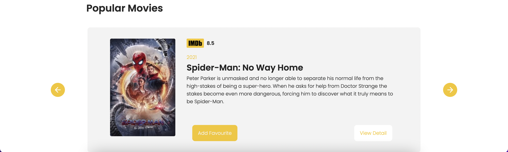
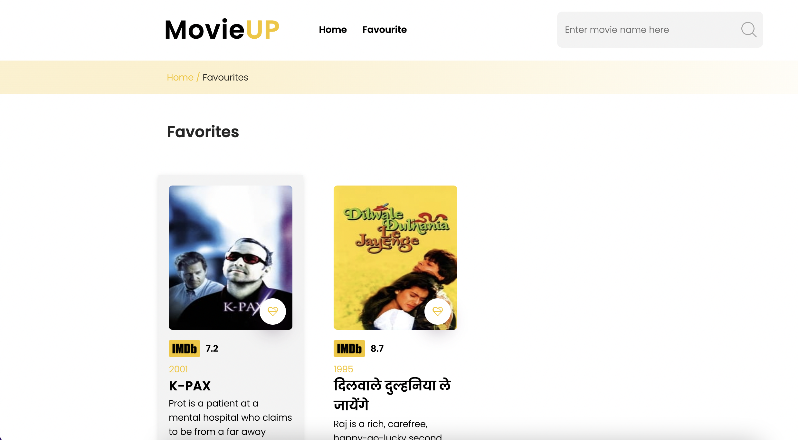
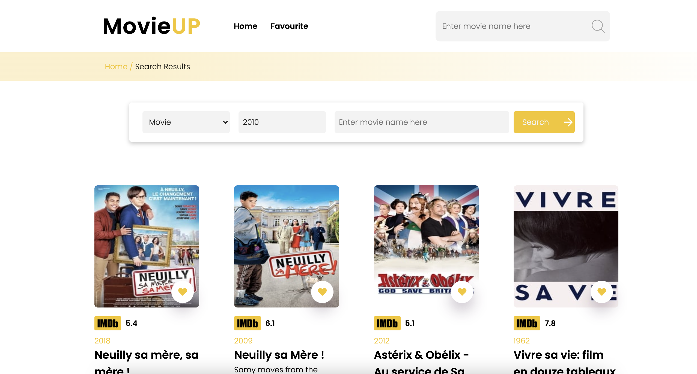
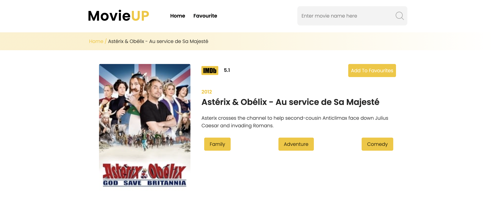

#MOVIE - APP

### Features
- Search movies order by type, name ,year 
  - You can search movies in two place
- Add and remove movies to favourite 
  - Every movie card has add and remove ability
- You can see details of movies on detail page
- You can see favourites on favourite page








### Setup
To setup the project, run the following on your terminal in the order:

```
    git clone https://github.com/mevlutcantuna/movie-app
```

```
    cd client
```    
```
    npm install
``` 
```
    npm start